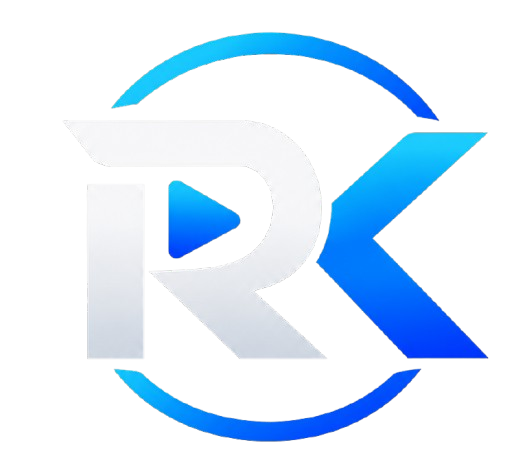

# RK Player - Official Website

  

  <strong>Your Music. Your Videos. Your Player.</strong> 
  An ultra-modern, high-performance next-generation media player designed for Windows.

---

## 🚀 Features

- 🎵 **Lossless Audio Engine**: Studio-grade playback supporting FLAC, WAV, ALAC, MP3, AAC, and OGG.
- 🎬 **Cinema 4K HDR**: Smooth 60fps & 120fps hardware-accelerated rendering.
- 🎚️ **10-Band Studio Equalizer**: Fine-tuned presets with bass boost and stereo enhancement.
- 💬 **Smart Subtitles**: Instant auto-sync with multi-language UTF-8 support.
- 🛡️ **Zero Ads, Zero Tracking**: 100% free and open-source media player.

---

## 💻 Downloads

- **Windows Installer (v1.0.0)**: `downloads/RK Player Setup 1.0.0.exe` (89.8 MB)
- **Windows Portable Edition (v1.0.0)**: `downloads/RK Player 1.0.0.exe` (89.6 MB)
- **SHA-256 Checksum**: `bf4fb2b06711010278aa3838eeff0140c9dab0f3290d0bd12f8341faaca66c81`

---

## 🌐 Live Website & GitHub Pages

Deployable directly via GitHub Pages:
1. Go to **Settings > Pages** in your GitHub repository.
2. Under **Build and deployment**, select `Deploy from a branch`.
3. Choose branch: `main` and folder: `/ (root)`.
4. Click **Save** — your site will be live!

---

## 📬 Contact & Support

- Developer: [tudurajanikanta@gmail.com](mailto:tudurajanikanta@gmail.com)
- License: MIT License
